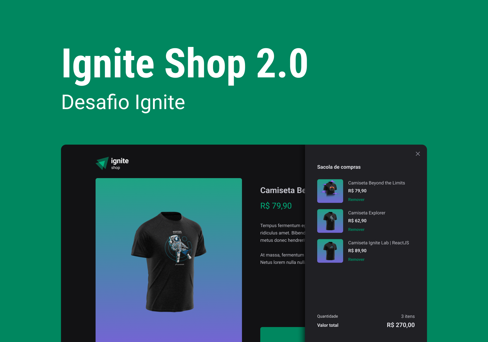
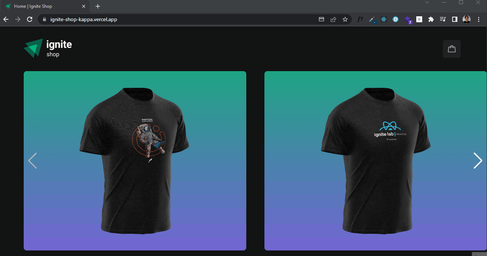

<h1 align="center">
    
</h1>

<p align="center">
  

  

  
  
  <a href="https://github.com/pabloxt14/Github-Blog/commits/master">
    
  </a>
    
   

   <a href="https://github.com/pabloxt14/Ignite-Shop/stargazers">
    
  </a>
</p>

<p>
  
</p>

<h4 align="center"> 
	🚧 Aplicação Finalizada 🚧
</h4>

<p align="center">
 <a href="#-about">About</a> |
 <a href="#-layout">Layout</a> | 
 <a href="#-deploy">Deploy</a> | 
 <a href="#-how-it-works">How It Works</a> | 
 <a href="#-technologies">Technologies</a> | 
 <a href="#-author">Author</a> | 
 <a href="#-license">License</a>
</p>


## 💻 About

O Ignite Shop é um aplicação web de vendas de camisetas com temas do mundo dev, mostrando com detalhes a parte visual e informacional das camisetas, além de apresentar um carrinho onde o cliente pode adicionar as suas compras.  

O principal conceito treinado nesta aplicação foi a utilização do framework Next.js, explorando conceitos como o de SSR(Server Side Rendering) e SSG(Static Site Generation), além da utilização da biblioteca Stitches.js para a estilização.

O projeto foi desenvolvido como conclusão de um desafio do curso **Ignite** oferecida pela [Rocketseat](https://www.rocketseat.com.br/). O Ignite é um curso de especialização em stacks específicas amplamente utilizadas e valorizadas no mercado como React, React Native, Node.js e Elixir.

---

## 🎨 Layout

Você pode visualizar o layout do projeto através [desse link](https://www.figma.com/file/FxlDRKOmznBbTH8DsTgnZU/Ignite-Shop-2.0/duplicate). É necessário ter conta no [Figma](https://www.figma.com/) para acessá-lo.

### Web

<p align="center">
  
</p>
<p align="center">
  
</p>

---

## 🔗 Deploy

Para acessar o deploy do Website da aplicação basta clicar no link a seguir: [Link](https://ignite-shop-kappa.vercel.app/)

---

## 🚀 How it works

Este projeto contem somente a parte Frontend Web, precisando somente executar a aplicação em seu Browser(navegador).

### Pré-requisitos

Antes de baixar o projeto você vai precisar ter instalado na sua máquina as seguintes ferramentas:

* [Git](https://git-scm.com)
* [NodeJS](https://nodejs.org/en/)
* [Yarn](https://yarnpkg.com/) ou [NPM](https://www.npmjs.com/)

Além disto é bom ter um editor para trabalhar com o código como [VSCode](https://code.visualstudio.com/)

Precisará também fazer a seguinte configuração para rodar o projeto:
* Criar uma conta e projeto no [Stripe](https://stripe.com/br), e copiar as chaves pública e privada do projeto
* Criar na raiz do projeto o arquivo `.env.local`
* Criar no arquivo `.env.local` as variáveis de ambiente, conforme o exemplo do arquivo `.env.example`
* Colocar nas variáveis de ambiente os respectivos valores, incluindo as chaves copiadas do projeto do STRIPE

Todos cartões de crédito disponíveis para teste (ex: 4242 4242 4242 4242) estão especificados na seguinte [documentação](https://stripe.com/docs/testing#cards) do Stripe

#### 🧭 Rodando a aplicação web (Frontend)

```bash
# Clone este repositório
$ git clone git@github.com:pabloxt14/Ignite-Shop.git

# Vá para a pasta da aplicação Front End
$ cd Ignite-Shop

# Instale as dependências
$ npm install

# Configure as variáveis de ambiente (conforme já explicado anteriormente)

# Execute a aplicação em modo de desenvolvimento
$ npm run dev

# A aplicação será aberta na porta:3000 - acesse http://localhost:3000
```

---

## 🛠 Technologies

As seguintes ferramentas foram usadas na construção do projeto:

#### **Website**  ([Next.js](https://nextjs.org/)  +  [TypeScript](https://www.typescriptlang.org/))

-   **[Stitches](https://stitches.dev/)**
-   **[Phosphor-Icons](https://phosphoricons.com/)**
-   **[RadixUI](https://www.radix-ui.com/)**
-   **[Axios](https://github.com/axios/axios)**
-   **[Stripe](https://stripe.com/br)**
-   **[Use Shopping Cart](https://useshoppingcart.com/docs)**
-   **[Swiper](https://swiperjs.com/)**

> Veja o arquivo  [package.json](https://github.com/pabloxt14/Ignite-Shop/package.json)

---
<!-- 
## 👨‍💻 Contribuidores

💜 Um super thanks 👏 para essa galera que fez esse produto sair do campo da ideia e entrar nas lojas de aplicativos :)

<!-- ## 💪 Como contribuir para o projeto

1. Faça um **fork** do projeto.
2. Crie uma nova branch com as suas alterações: `git checkout -b my-feature`
3. Salve as alterações e crie uma mensagem de commit contando o que você fez: `git commit -m "feature: My new feature"`
4. Envie as suas alterações: `git push origin my-feature`
> Caso tenha alguma dúvida confira este [guia de como contribuir no GitHub](./CONTRIBUTING.md)

---
-->

## ✍ Author


[](https://www.linkedin.com/in/pabloalan/) 

[](mailto:pabloxt14@gmail.com)

---

## 📝 License

Este projeto esta sobe a licença [MIT](./LICENSE).

Feito com 💜 por Pablo Alan 👋🏽 [Entre em contato!](https://www.linkedin.com/in/pabloalan/)
